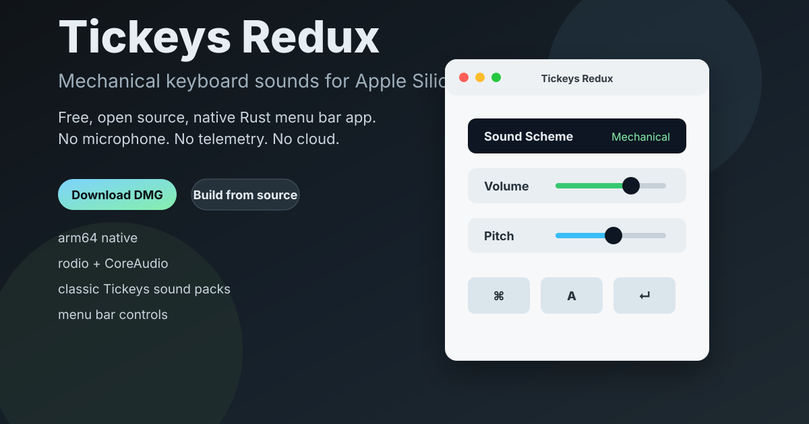

# Tickeys Redux

Native Apple Silicon menu bar app that brings mechanical keyboard sounds back to modern macOS.

[English](README.md) | [中文](README_zh-CN.md)



**Free, open source, local-only. No microphone. No telemetry. No cloud.**

[Download from Releases](https://github.com/E-R-Butch/TickeysRedux/releases) · [Build from source](#building-the-app-bundle) · [中文说明](README_zh-CN.md)

Tickeys Redux is a modern macOS port of [Tickeys](https://github.com/yingDev/Tickeys) by Ying Yuandong. It keeps the playful typing feedback of the original app, but rebuilds the runtime for Apple Silicon with Rust, objc2, rodio, CoreAudio, and a clean menu bar interface.

> **Apple Silicon only.** This project targets arm64 Macs. Intel Mac users should use the [original Tickeys](https://github.com/yingDev/Tickeys).

## Why Try It

- **Instant typing feedback** with bundled mechanical, typewriter, sword, drum, bubble, and Cherry G80 sound packs.
- **Native menu bar workflow**: switch schemes, adjust volume, and tune pitch without opening a full app window.
- **Privacy-respecting by design**: uses macOS Input Monitoring to detect key events, not a microphone.
- **No background web services**: no telemetry, cloud sync, analytics, or update beacon.
- **Modern native stack**: Rust 2024, objc2, rodio, CoreAudio, and an auditable app bundle script.
- **Classic Tickeys spirit**: preserves the original fun while removing legacy dylib dependencies.

## Demo

The app lives quietly in the menu bar. Pick a sound scheme, set volume and pitch, then type. Each key-down event plays a short local WAV sample immediately.

```text
Menu bar -> Sound Scheme -> Mechanical / Typewriter / Sword / Drum / Bubble / Cherry
Menu bar -> Volume       -> 25% / 50% / 75% / 100%
Menu bar -> Pitch        -> 0.5x / 1.0x / 1.5x / 2.0x
```

## Install

Download the latest `.dmg` from [Releases](https://github.com/E-R-Butch/TickeysRedux/releases), open it, and copy `Tickeys Redux.app` to Applications.

Official releases use a persistent, free self-signed identity—not a paid Apple Developer ID—and are not notarized. If macOS blocks the first launch, Control-click `Tickeys Redux.app`, choose **Open**, then confirm **Open**.

On first launch, grant **Input Monitoring** permission when macOS asks. Tickeys Redux needs this permission to know that a key was pressed; it does not record text or use the microphone. Open the app again after granting access; if key sounds are still silent, quit Tickeys Redux completely and relaunch it.

## What's New in v1.0.7

- Start at Login now uses the complete `SMAppService` state machine, reports registration errors, and opens Login Items settings when macOS approval is required.
- Fixed menu-bar volume persistence that could make the app 100× quieter after relaunch.
- Audio output now reconnects in the background if CoreAudio is not ready at login or the output device is lost, instead of staying permanently silent.
- Keyboard monitoring now recovers when macOS disables the event tap and resumes cleanly after sleep instead of relaunching the process.
- A visible recovery prompt now explains how to repair stale Input Monitoring permission after an upgrade and opens the correct System Settings page.
- Reopening the app shows Preferences, even when the menu-bar icon is hidden.
- Fixed a deterministic menu-object leak and hardened release packaging/verification.

| | Original | Redux |
|---|---|---|
| **Architecture** | x86_64 | **arm64 native** |
| **Audio engine** | OpenAL + libalut (.dylib) | **rodio** (pure Rust → CoreAudio) |
| **UI framework** | cocoa 0.2 + XIB | **objc2 0.6** + NSStatusBar |
| **Rust edition** | 2015 | **2024** |
| **Settings** | Unfinished XIB window | 🎹 **Menu bar** — scheme/volume/pitch |
| **Permissions** | None | **Input Monitoring** (native macOS prompt) |
| **Update checker** | Built-in | **Removed** |
| **macOS target** | 10.10+ | **13+** |

## Usage

1. Launch `Tickeys Redux.app`
2. Grant **Input Monitoring** permission when the system prompt appears
3. Click 🎹 in the menu bar to:
   - Switch sound schemes (bubble, Cherry G80-3000/3494, drum, mechanical, sword, typewriter...)
   - Adjust volume (25%/50%/75%/100%)
   - Adjust pitch (0.5x–2.0x)
4. Start typing — instant key sounds

## Building the App Bundle

Requires Rust 1.85+.

```sh
git clone https://github.com/E-R-Butch/TickeysRedux.git
cd TickeysRedux
./scripts/package_app.sh
```

This script handles:
- `cargo build --release --locked`
- Creates `Tickeys Redux.app` bundle with all resources
- Writes `Info.plist` (version read from `Cargo.toml`)
- Ad-hoc codesigns and verifies the bundle

### Manual Build

```sh
export MACOSX_DEPLOYMENT_TARGET=13.0
cargo build --release --locked
mkdir -p "Tickeys Redux.app/Contents/MacOS"
mkdir -p "Tickeys Redux.app/Contents/Resources"
cp target/release/tickeys-redux "Tickeys Redux.app/Contents/MacOS/"
rsync -a --exclude='*.bak' --exclude='*.wav.bak' assets/data/ "Tickeys Redux.app/Contents/Resources/data/"
cp assets/tickeys_redux.icns "Tickeys Redux.app/Contents/Resources/tickeys.icns"
cp -R assets/lproj/Base.lproj "Tickeys Redux.app/Contents/Resources/Base.lproj"
cp -R assets/lproj/zh-Hans.lproj "Tickeys Redux.app/Contents/Resources/zh-Hans.lproj"
# Write Info.plist, then:
codesign --force --deep --sign - "Tickeys Redux.app"
codesign --verify --deep --strict "Tickeys Redux.app"
```

### Verification

After building, verify the bundle is healthy:

```sh
MACOSX_DEPLOYMENT_TARGET=13.0 cargo build --release --locked
./scripts/package_app.sh
codesign --verify --deep --strict --verbose=2 "Tickeys Redux.app"
plutil -lint "Tickeys Redux.app/Contents/Info.plist"
```

## Custom Sound Schemes

Add your own `.wav` files under `assets/data/` and edit `assets/data/schemes.json`:

```json
{
    "name": "myScheme",
    "display_name": "My Scheme",
    "files": ["1.wav", "2.wav", "3.wav"],
    "non_unique_count": 3,
    "key_audio_map": {}
}
```

## Tech Stack

| Component | Library | Purpose |
|---|---|---|
| Audio | rodio 0.20 | WAV decode + playback via CoreAudio |
| UI | objc2 0.6 | NSStatusBar, NSMenu, NSAlert |
| Keyboard | CGEventTap (FFI) | Global key-down monitoring |
| Concurrency | crossbeam 0.8 | Audio worker thread channel |
| Config | serde + serde_json | Scheme definition parsing |
| Prefs | NSUserDefaults | Persist scheme/volume/pitch |

## Permissions

Tickeys Redux uses `CGEventTapCreate` to listen for global key-down events. This requires **Input Monitoring** permission on macOS. The system prompt appears automatically on first launch. After enabling it, open Tickeys Redux again; if key sounds are still silent, quit the app completely and relaunch it. No Accessibility permission is needed.

Each local `cargo build` uses a changing ad-hoc identity, so macOS may ask you to grant Input Monitoring again after rebuilding. Official releases from v1.0.7 onward use the persistent self-signed identity documented in [docs/signing.md](docs/signing.md). Upgrading from an older ad-hoc release requires one permission repair; later releases signed with the same identity can retain it.

Start at Login uses Apple's `SMAppService` API and therefore requires macOS 13 or later. v1.0.7 surfaces any registration error from macOS instead of silently showing a checked box.

## Project Metadata

Suggested GitHub topics are listed in [docs/github-metadata.md](docs/github-metadata.md).

## License

MIT — original work by [应元东](https://github.com/yingDev), Redux port by [Sinclair](https://github.com/E-R-Butch).
